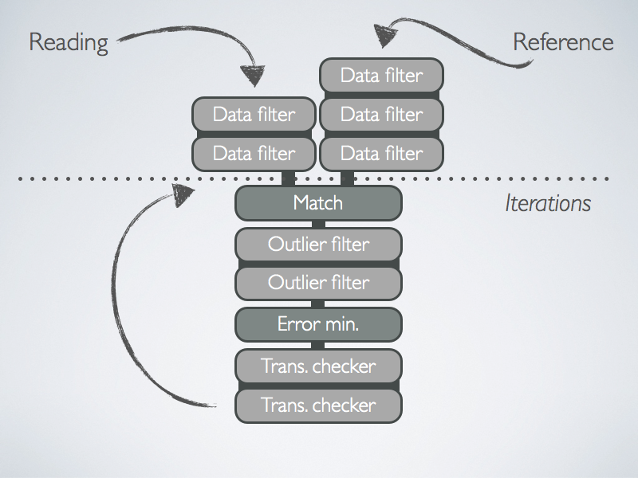
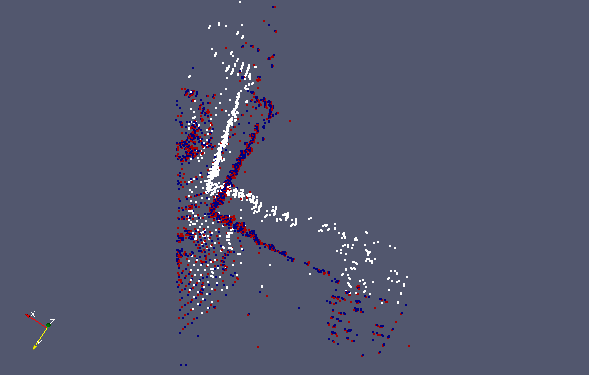

| [Tutorials Home](Pointclouds.md)    | [Previous](Pointclouds.md) | [Next](Transformations.md) |
| ------------- |:-------------:| -----:|

# Writing a program which performs ICP
######Latest update May 1, 2014 by Samuel Charreyron

## Overview

The following tutorial will go through the various steps that are performed in a basic ICP registration example.  The source code associated with this tutorial can be found in [examples/icp_simple.cpp](../examples/icp_simple.cpp).

Point cloud registration is a critical step in 3D reconstruction of objects and terrains and is used in such varied fields as robotics, medicine, and geography. 

In this example we will be performing registration between two point clouds.  One is referred to as the reading cloud, and the other the reference cloud.  Registration is more explicitly the goal of finding a rigid geometric transformation that can be applied to the reading cloud such that it is most closely aligned with the reference cloud.  Each point in the reading cloud can then be associated to a *closest point* in the reference cloud.  The "closeness" of the alignment is most often some cost function such as the sum of mean square distances between point associations.  The goal is evidently to optimize the alignment and therefore find a rigid transformation which minimizes the cost function.

The ICP algorithm has the following characteristics:

* The algorithm is iterative such that each iteration improves the alignment between reading and reference clouds.
* The non-ideal nature of point clouds leads to the use of data filters and outlier filters.  These can be used to remove noisy or redundant points.  Data filters can also augment point clouds with additional descriptors which may be useful for registration.  A detailed overview of data filters can be found [here](Datafilters.md).

The various components which comprise the ICP registration system are shown in the following diagram.    



**Figure 1:** High level diagram of an ICP chain<a name="icp_chain_diagram"></a>

Firstly, the reading and reference clouds are processed using a combination of data filters so as to remove noise and augment data-points with descriptive information.  The matching step associates each point in the the reading cloud with one in the reference cloud.  Statistical outliers are removed by a chain of outlier filters.  Subsequently, a transformation is computed by solving the cost minimization step.  Transformations are verified such that they improve alignment at ever iteration and therefore that the process converges towards an optimal transformation.

## A Very Simple ICP program
The program contained in `icp_simple.cpp` performs registration between point clouds using the default settings of libpointmatcher.  The point clouds should be encoded in .csv files.  Some example point clouds are located in the `examples/data/` directory.  We will now step through and explain the code.

The `validateArgs` function is used to ensure that exactly two arguments are supplied: the paths to the reference and reader clouds.  Note that the first argument specifies the reference and the second the reader. 
```cpp
void validateArgs(int argc, char *argv[], bool& isCSV )
{
	if (argc != 3)
	{
		cerr << "Wrong number of arguments, usage " << argv[0] << " reference.csv reading.csv" << endl;
		cerr << "Will create 3 vtk files for inspection: ./test_ref.vtk, ./test_data_in.vtk and ./test_data_out.vtk" << endl;
		cerr << endl << "2D Example:" << endl;
		cerr << "  " << argv[0] << " ../examples/data/2D_twoBoxes.csv ../examples/data/2D_oneBox.csv" << endl;
		cerr << endl << "3D Example:" << endl;
		cerr << "  " << argv[0] << " ../examples/data/car_cloud400.csv ../examples/data/car_cloud401.csv" << endl;
		exit(1);
	}
}
```
The following three lines simply rename types that are used in the program into something more convenient.  The `PointMatcher` base class contains all the relevant objects and functions that are used in the ICP process.  The `DataPoints` class represents a point cloud.

```cpp
typedef PointMatcher<float> PM;
typedef PM::DataPoints DP;
typedef PM::Parameters Parameters;
```

We now read the reference and reader from csv files by using the ``load`` function, which outputs a `DataPoints` object.

```cpp
// Load point clouds
const DP ref(DP::load(argv[1]));
const DP data(DP::load(argv[2]));
```

The `ICP` class represents the ICP chain shown in [Figure 1](#icp_chain_diagram).  We create an object instantiation of an ICP chain and apply the default settings using `setDefault`.  A view of the default ICP chain configuration is shown [here](DefaultICPConfiguration.md).

```cpp
// Create the default ICP algorithm
PM::ICP icp;
	
// See the implementation of setDefault() to create a custom ICP algorithm
icp.setDefault();
```

The entire registration process is performed by applying the functor `TransformationParameters ICP(DataPoints ref, DataPoints data)`.  The optimal transformation is stored in a TransformationParameters object.

```cpp
// Compute the transformation to express data in ref
PM::TransformationParameters T = icp(data, ref);
```

We can then apply the obtained transformation to the reading cloud so that it is aligned with the reference.  First we create a new `DataPoints` object to store the aligned reading cloud and then use the `apply(DataPoints out, TransformationParameters param)` to apply the alignment.

```cpp
// Transform data to express it in ref
DP data_out(data);
icp.transformations.apply(data_out, T);
```

In the final step, we save the reference, reading, and aligned reading point clouds to the `examples/` directory.  Note that the files are saved as .vtk files instead of .csv files so that they can be visualized with [ParaView](http://www.paraview.org/).  In the final line, we display the transformation parameters in the console using the `<<` operator on the `TransformationParameters` object.

```cpp
// Safe files to see the results
ref.save("test_ref.vtk");
data.save("test_data_in.vtk");
data_out.save("test_data_out.vtk");
cout << "Final transformation:" << endl << T << endl;
```

### Car Example
We run the example code with the car 3D point clouds in `/examples/data/car_cloud400.csv` and `/examples/data/car_cloud401.csv`.
```
examples/icp_simple ../examples/data/car_cloud400.csv ../examples/data/car_cloud401.csv
```
The program prints out the transformation matrix obtained by the ICP registration
```
Final transformation:
  0.981598   0.170036 -0.0869051  0.0730435
 -0.153273   0.973006    0.17253   0.192502
  0.113896  -0.156035   0.981163 -0.0353594
         0          0          0          1
```


**Figure 2:** Visualization of ICP on car example.  The white points correspond to the reading cloud, red to the reference, and blue to the aligned reading cloud.