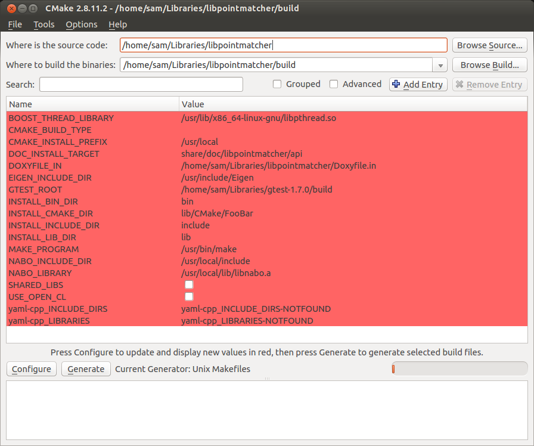

| [Tutorials Home](Tutorials.md)    | | [Next](Datafilters.md) |
| ------------- |:-------------:| -----:|

# Compiling and Installing libpointmatcher on your Computer
######Latest update January 9, 2014 by Samuel Charreyron

## Foreword
*The following instructions are aimed at users of Ubuntu Linux.  The steps from this tutorial were performed on __Ubuntu 13.10__ (Saucy Salamander).  These instructions should be identical previous versions of Ubuntu.  Other Linux variants should follow a very similar process as with Mac OSX and other \*nix operating systems.*

## Option 1: Installing libpointmatcher from Pre-built Binaries (Ubuntu)
A pre-built version of the library is available on the [following](https://launchpad.net/~stephane.magnenat) Personal Package Archive (PPA). Instructions on how to add a PPA to Ubuntu can be found [here](https://launchpad.net/+help-soyuz/ppa-sources-list.html).  Once the PPA has been added to your system, simply run:

```
sudo apt-get install libpointmatcher-dev
```
to install libpointmatcher to your system.

## Option 2: Detailed Installation Instructions 
### Some Basic Requirements 

#### a. Installing Boost
[Boost](www.boost.org) is a widely-used C++ library and is included in most Linux distributions.  You can quickly check if Boost is installed on your system by running

```
ldconfig -p | grep libboost
```

If you see a list of results then you can skip to the next section.  If not, you most likely have to install Boost.

Instructions for downloading and installing boost to Unix systems can be found [here](http://www.boost.org/doc/libs/1_55_0/more/getting_started/unix-variants.html).  Boost can also be installed as a package by running

```
sudo apt-get install libboost-all-dev
```

#### b. Installing Git
[Git](http://git-scm.com/) is a version control system similar to SVN designed for collaboration on large code projects.  Because libpointmatcher is hosted on Github, you should the git application to keep track of code revisions, and bug fixes pushed to the public repository.

Git should already be installed on your system but you can check if it is by running

```
git --version 
```
If Git is installed, you should see a message of the form
```
git version 1.8.3.2
```
If not refer to the Git homepage for installation instructions or install via the package manager by running
```
sudo apt-get install git-core
```
#### c. Installing CMake
[CMake](http://www.cmake.org/) is a cross-platform build system and is used for building the libpointmatcher library.  Refer to the homepage for installation instructions, or you can once again use the package manager
```
sudo apt-get install cmake cmake-gui
```
*NOTE:* CMake has a GUI called cmake-gui which can be useful for configuring builds.  We recommend you install this as well as it will be referred to in this tutorial.

### 1. Installing Eigen
The Eigen linear algebra is required before installing libpointmatcher and can be found [here](http://eigen.tuxfamily.org/).  Either download and compile Eigen following instructions from the package website or simply install package via apt by running:
```
sudo apt-get libeigen3-dev
```

### 2. Installing libnabo
libnabo is a library for performing fast nearest-neighbor searches in low-dimensional spaces.  It can be found [here](https://github.com/ethz-asl/libnabo).  Clone the source repository into a local directory of your choice.
```
mkdir ~/Libraries/
cd ~/Libraries
git clone git://github.com/ethz-asl/libnabo.git
cd libnabo
``` 

Now you can compile libnabo by entering the following commands
```
SRC_DIR=`pwd`
BUILD_DIR=${SRC_DIR}/build
mkdir -p ${BUILD_DIR} && cd ${BUILD_DIR}
cmake -DCMAKE_BUILD_TYPE=RelWithDebInfo ${SRC_DIR}
make
sudo make install
```
This will compile libnabo in a `/build` directory and install it on your system.

*Note:* If Eigen or Boost are not in their regular system locations you will have to indicate their location by setting the corresponding CMake flags.

### 3. Installing yaml-cpp (Optional)
Configuration files can be managed using YAML in libpointmatcher.  This allows users to edit configuration files in a readable format.  To support this, you need to install [yaml-cpp](http://code.google.com/p/yaml-cpp/). Either compile and install from the source or install package by running:
```
sudo apt-get install libyaml-cpp-dev
```

#### Warning for users of Ubuntu 14.04 (Trusty Tahr) or more recent versions
The yaml-cpp package for Trusty Tahr provides yaml-cpp0.5. Libpointmatcher is compatible with yaml-cpp0.3 and thus an older version of yaml-cpp should be installed manually.


### 5. Compiling the Documentation
Libpointmatcher is documented directly in the source-code using [Doxygen](http://www.stack.nl/~dimitri/doxygen/).  If Doxygen is installed on your system, an html version of the documentation will be compiled in `/usr/local/share/doc/libpointmatcher/`.  To install Doxygen in Ubuntu, run:

```
sudo apt-get doxygen
```

Once you have compiled libpointmatcher in step 6, you can simply open `/usr/local/share/doc/libpointmatcher/api/html/index.html` in a browser to view the API documentation.

### 6. Installing libpointmatcher
Clone the source repository into a local directory.  As an example we reuse the Libraries directory that was created to contain the libnabo sources.
```
cd ~/Libraries/
git clone git://github.com/ethz-asl/libpointmatcher.git
cd libpointmatcher
```
Now, libpointmatcher is compiled into a `/build` directory.
```
SRC_DIR=`pwd`
BUILD_DIR=${SRC_DIR}/build
mkdir -p ${BUILD_DIR} && cd ${BUILD_DIR}
cmake -DCMAKE_BUILD_TYPE=RelWithDebInfo ${SRC_DIR}
make
```

You can optionally verify that the version of libpointmatcher you have compiled is stable by running the unit tests.
```
utest/utest --path ../examples/data/
```

Finally, to install libpointmatcher to your system run the following:
```
sudo make install
```

#### Possible Caveats
If Eigen, libnabo, yaml-cpp, or GTest are not found during the installation, you will have to manually supply their installation locations by setting the CMake flags.  You can do so using the CMake GUI.
```
cd build
cmake-gui .
```


<!--If yaml-cpp was installed using apt-get as described above, it will not be found by the default CMake configuration.  You should set the `yaml-cpp_INCLUDE_DIRS` and `yaml-cpp_LIBRARIES` to `/usr/include/yaml-cpp` and `/usr/lib/x86_64-linux-gnu/` respectively.  These locations could be different on your machine.  You can find them by the files installed by the libyaml package:
```
dpkg -L libyaml-cpp-dev
```
-->
You can then set `EIGEN_INCLUDE_DIR`, `NABO_INCLUDE_DIR`, `NABO_LIBRARY`, `GTEST_ROOT`, `yaml-cpp_INCLUDE_DIRS`, `yaml-cpp_LIBRARIES` to point to your installation directories as shown in the screenshot above.  Then, generate the make files by clicking generate and rerun the following inside `/build`:
```
make
sudo make install
```


| [Tutorials Home](Tutorials.md)    | | [Next](Datafilters.md) |
| ------------- |:-------------:| -----:|