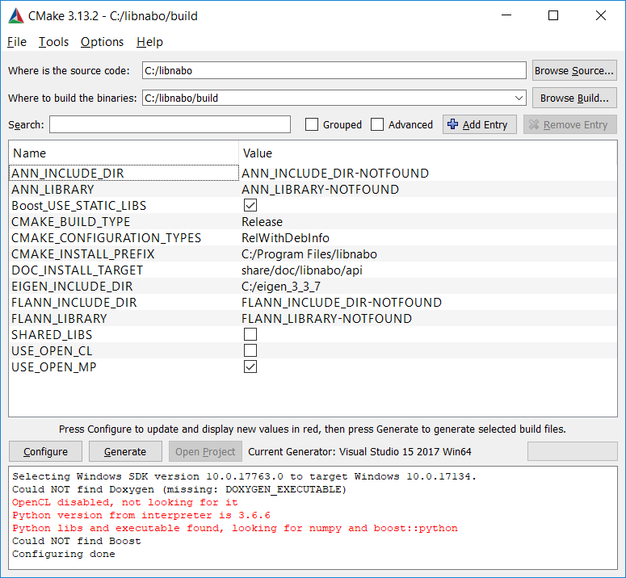
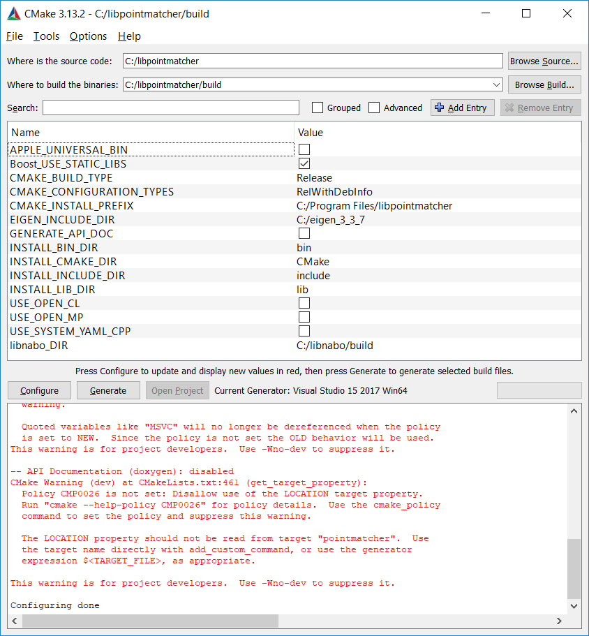

| [Tutorials Home](index.md)    | | [Next](Datafilters.md) |
| ------------- |:-------------:| -----:|

# Compiling and Installing libpointmatcher on Windows

## Compiling using MSVC (Microsoft Visual Studio)

### In Short...

If you are used to development project, here is what you need:


| Name   | Link | Version <br> (Tested March 29, 2014)|
| ------ | ---- | ------------- |
| Windows |     | 7              |
|  git | <http://windows.github.com/> | v1.0 |
|  libpointmatcher sources   | <https://github.com/ethz-asl/libpointmatcher> | |
| libnabo sources | <https://github.com/ethz-asl/libnabo> |  |
| Visual Studio |  <http://www.microsoft.com/visualstudio/eng/downloads>  | Visual Studio 2012 Express for Windows Desktop |
| CMake | <http://www.cmake.org/cmake/resources/software.html> | cmake-2.8.11.2-win32-x86.exe|
| Eigen 3 | <http://eigen.tuxfamily.org/index.php?title=Main_Page#Download>  |v3.2.0 |
| Boost | <http://www.boost.org/users/download/> | v1.54.0 |
| grep tool | <http://gnuwin32.sourceforge.net/packages/grep.htm>| v2.5.4 |

The rest of this tutorial will guide you through the different requirements step by step.

### Install grep tool
Install `grep` by following the instructions in <http://gnuwin32.sourceforge.net/packages/grep.htm>. You might need to modify the Path environment variables to make sure that grep can be run from anywhere. To test:
```
cd\
grep --version
```

### Building Boost
1. Open a console that knows the path to the MSVC compiler command (cl). We suggest using **Windows PowerShell**. An alternative is **Developer Command Prompt**, which can be located in the Start menu in the Visual Studio section.
1. Go to your Boost source directory, and do:

    ```
    $ bootstrap
    $ b2 install --prefix=build address-model=64
    ```

1. It may take a while to finish.


### Build libnabo
1. Start **CMake GUI**

1. Add the path of your libnabo source folder in the field _Where is the source code_.
1. Add a folder named build in the field _Where to build the binary_. This will allow you to do out-of-source compilation.
1. Click on the button Configure
    1. Select the generator for the project (Visual Studio 11 Win 64)
    1. Typically you will select "Use default native compilers" for the generator
    1. Click "Finish"
    1. An error will be reported, because CMake does not know yet where to find the libraries. The next steps will tell it where to find them.

1. Locate _your eigen folder_ in the field **EIGEN_INCLUDE_DIR**

1. Add the following boolean variable and set it to `true`: **Boost_USE_STATIC_LIBS**

1. Add the following PATH variable and set it to _(your boost folder)_/build: **BOOST_ROOT**

1. Change the variable **CMAKE_CONFIGURATION_TYPES** to `RelWithDebInfo`

1. Click on the button Configure again, then on Generate. Here is an example of what your CMake should look like:
 
	


1. Locate the Microsoft Visual Studio Solution file (libnabo.sln) in the your build folder and open it. Visual Studio should open.

1. Build the solution: BUILD -> Build Solution

    Alternatively, you can build the solution from the command line. In _(your libnabo folder)_/build:
    
    ```
    $ msbuild /m:2 libnabo.sln
    ```
    
    (Note that the flag /m:X defines the number of cores msbuild will use while building the solution.)


### Build libpointmatcher
1. Start **CMake GUI**, follow the same steps to configure the source and build folders for _libpointmatcher_, then click the Configure button.

1. Add the following boolean variable and set it to true: Boost_USE_STATIC_LIBS

1. Add the following PATH variable and set it to _(your Boost folder)_/build: BOOST_ROOT

1. Change the variable **CMAKE_CONFIGURATION_TYPES** to `RelWithDebInfo`

1. You will need to manually add and set the following variables:

    - **EIGEN_INCLUDE_DIR** (PATH type) to _(your eigen source folder)_
    - **NABO_INCLUDE_DIR** (PATH type) to _(your libnabo source folder)_
    - **NABO_LIBRARY** (FILEPATH type) to _(your libnabo source folder)_/build/RelWithDebInfo/nabo.lib
    - **libnabo_DIR** will automatically be set to your libnabo build folder
    - **yaml-cpp_INCLUDE_DIRS** (PATH type) to _(your yaml-cpp source folder)_
    - **yaml-cpp_LIBRARIES** (FILEPATH type) to _(your yaml-cpp source folder)_/build/RelWithDebInfo/libyaml-cppmd.lib
    - **GTEST_INCLUDE_DIR** (PATH type) to _(your gtest source folder)_
    - **GTEST_LIBRARY** (FILEPATH type) to _(your gtest source folder)_/build/RelWithDebInfo/gtest.lib
    - **GTEST_MAIN_LIBRARY** (FILEPATH type) to _(your gtest source folder)_/build/RelWithDebInfo/gtest_main.lib

1. Click on the button Configure, then on Generate. Here is an example of what your CMake should look like:

	
	
1. In Visual Studio, build the solution: BUILD -> Build Solution

    Alternatively, you can build the solution from the command line. In _(your libpointmatcher folder)_/build:
    
    ```
    $ msbuild /m:2 libpointmatcher.sln
    ```
    
    (Note that the flag /m:X defines the number of cores msbuild will use while building the solution.)


## Reporting Issues

Currently, we don't have a developer fully supporting compilation on Windows. If you can help refreshing this documentation, your help is more than welcome.

Before reporting new building issues, have a look in the current/past list of issues. Add as much details as you can since you will most probably receive answers from developers that cannot reproduce the problem on their side. Here are some of them:

- Your directory structure need to be well organized as mention in [Issue #136](https://github.com/ethz-asl/libpointmatcher/issues/136).
- There might be some problems related to libnabo as mention in [Issue #128](https://github.com/ethz-asl/libpointmatcher/issues/118).

## Special Thanks

Special thanks to the following users in helping us with the Windows support:

- [kwill](https://github.com/kwill) for keeping the documentation up-to-date and investing time to make libpointmatcher compiling on Windows.
- [braddodson](https://github.com/braddodson) for porting a version of libpointmacher in `C#` with a limited set of features. The code can be found here: https://github.com/braddodson/pointmatcher.net


