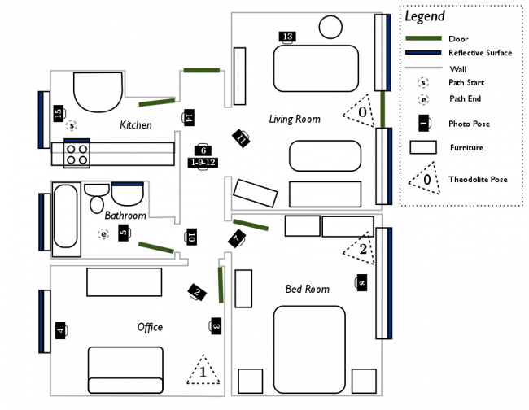

# Datapoint Filters

In this section, the various filters which can be applied to the reading and reference point clouds before performing the ICP process.

As a reminder, *datapoint filters* can have several purposes:

* Removing noisy points which render the alignment of point clouds difficult.
* Removing redundant points so as to speed up alignment 
* Adding descriptive information to the points such as a surface normal vector, or the direction from the point to the sensor.

Note that *datapoint filters* differ from *outlier filters* which appear further down the ICP chain and have a different purpose.

[Libpointmatcher](https://github.com/ethz-asl/libpointmatcher) provides developers with a number of datapoint filters which process an input point cloud into an intermediate point cloud used in the alignment procedure.  Filters function as independent modules that can and often are combined into chains.  Sequential chains of datapoint filters can thus be adapted to the alignment problem at hand.

## An Example Point Cloud View of an Appartment

The following examples are drawn from the apartment dataset available for [download](http://projects.asl.ethz.ch/datasets/doku.php?id=laserregistration:apartment:home) from the ASL at ETH Zurich.  A top-down view of the point cloud is depicted below, with the colors showing vertical elevation.  The ceiling has been removed from the point cloud such that the floor (in blue) and the walls (in red) are clearly visible.  Note that the coordinate origin is placed in the kitchen at the starting point of data capture, which is in the top-left of the top-down view and floor plan.

## Bounding Box Filter
### Description
Points can be excluded from a rectangular bouding region by using this filter.  The box dimensions are specified by defining the maximum and minimum coordinate values in the x,y,z directions. 

|Parameter  |Description  |Default value    |Allowable range|
|---------  |:---------:  |----------------:|--------------:|
|xMin       |Minimum value on the x-axis defining one side of the box | -1.0 | -inf to inf|
|xMax       |Maximum value on the x-axis defining one side of the box | 1.0 | -inf to inf|
|yMin       |Minimum value on the y-axis defining one side of the box | -1.0 | -inf to inf|
|yMax       |Maximum value on the y-axis defining one side of the box | 1.0 | -inf to inf|
|zMin       |Minimum value on the z-axis defining one side of the box | -1.0 | -inf to inf|
|zMax       |Maximum value on the z-axis defining one side of the box | 1.0 | -inf to inf|
|removeInside   |if set to 1, points contained within the box are removed, else points outside are removed  |1   | 0 or 1|

### Example

