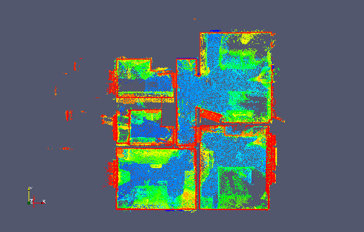
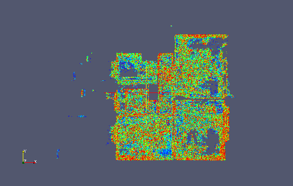
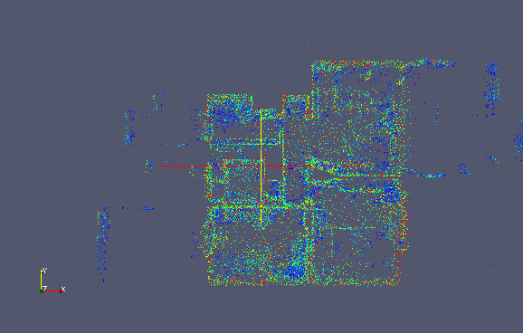
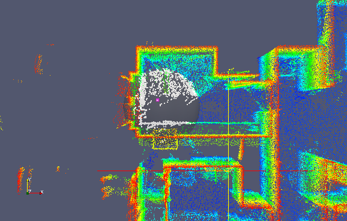

# Datapoint Filters

In this section, the various filters which can be applied to the reading and reference point clouds before performing the ICP process.

As a reminder, *datapoint filters* can have several purposes:

* Removing noisy points which render the alignment of point clouds difficult.
* Removing redundant points so as to speed up alignment 
* Adding descriptive information to the points such as a surface normal vector, or the direction from the point to the sensor.

Note that *datapoint filters* differ from *outlier filters* which appear further down the ICP chain and have a different purpose.

[Libpointmatcher](https://github.com/ethz-asl/libpointmatcher) provides developers with a number of datapoint filters which process an input point cloud into an intermediate point cloud used in the alignment procedure.  Filters function as independent modules that can and often are combined into chains.  Sequential chains of datapoint filters can thus be adapted to the alignment problem at hand.

## An Example Point Cloud View of an Appartment

The following examples are drawn from the apartment dataset available for [download](http://projects.asl.ethz.ch/datasets/doku.php?id=laserregistration:apartment:home) from the ASL at ETH Zurich.  A top-down view of the point cloud is depicted below, with the colors showing vertical elevation.  The ceiling has been removed from the point cloud such that the floor (in blue) and the walls (in red) are clearly visible.  Note that the coordinate origin is placed in the kitchen at the starting point of data capture, which is in the top-left of the top-down view and floor plan.

## Bounding Box Filter
### Description
Points can be excluded from a rectangular bounding region by using this filter.  The box dimensions are specified by defining the maximum and minimum coordinate values in the x,y,z directions. 

|Parameter  |Description  |Default value    |Allowable range|
|---------  |:---------:  |----------------:|--------------:|
|xMin       |Minimum value on the x-axis defining one side of the box | -1.0 | -inf to inf|
|xMax       |Maximum value on the x-axis defining one side of the box | 1.0 | -inf to inf|
|yMin       |Minimum value on the y-axis defining one side of the box | -1.0 | -inf to inf|
|yMax       |Maximum value on the y-axis defining one side of the box | 1.0 | -inf to inf|
|zMin       |Minimum value on the z-axis defining one side of the box | -1.0 | -inf to inf|
|zMax       |Maximum value on the z-axis defining one side of the box | 1.0 | -inf to inf|
|removeInside   |if set to 1, points contained within the box are removed, else points outside are removed  |1   | 0 or 1|

### Example
In the following example, a box filter of the following dimensions was applied to the input point cloud.

|Parameter | Value|
|---------|:-------|
|xMin | -1.0 |
|xMax | 1.0 |
|yMin | -1.0 |
|yMax | 1.0 |
|zMin | -1.0 |
|zMax | 2.0 |
|removeInside | 0 |

Note that only points **outside** the bounding box are removed by the filter by setting the property *removeInside* to 0.  Because the point cloud center is located in the kitchen in the top-left, a square region of 2m x 2m is selected by this filter.  In the following image, the output of the filter is overlaid in white.

## Maximum Density Filter
### Description
A number of filters are used to reduce the number of points in a cloud by randomly sub-sampling or randomly rejecting a set of points.  Points in regions of high density often contain redundant information, and the ICP algorithm could be performed more efficiently with a smaller number of points.  This filter is thus used to homogenize the density of a point cloud by rejection a sub-sample of points in high-density regions.

Points are only considered for rejection if they exceed a density threshold, otherwise they are preserved.  The single parameter of this filter sets the maximum density that should be obtained in the output point cloud.  Points are randomly rejected such that this maximum density is obtained as closely as possible.  

|Parameter  |Description  |Default value    |Allowable range|
|---------  |:---------:  |----------------:|:--------------|
|maxDensity |The desired maximum density of points in *points/m^3* | 10 | min: 0.0000001, max: inf|   

### Example
In the following example we observe the effect of the maximum density filter on the apartment point cloud.  Sub-sampling occurs mostly in high density regions, which colored in red in both images.  The result is an image with lower density overall with the low density regions in blue being preserved. 

**Figure A:** Before applying filtering the points are colored by density with high density regions in red and low density regions in blue

**Figure B:** After applying maximum density filter with target density set to 1 point/m^3

## Maximum and Minimum Distance Filters
### Description
These filters remove points which lie beyond a threshold distance from the coordinate center.  For the minimum distance filter, points are kept if their distance from the center **greater than** the threshold while for the maximum distance filter if it is **smaller than** the threshold.   The distance threshold can be defined on the x,y, and z axes or can be a radial distance from the center.

|Parameter  |Description  |Default value    |Allowable range|
|---------  |:---------:  |----------------:|:--------------|
|dim        | Dimension over which the distance is thresholded.  If -1, then the threshold is a radial distance from the center | -1 | 0: x, 1: y, 2: z, -1: radial|
|maxDistance or minDistance |Distance threshold (in m) beyond which points are rejected/selected | 1.0 | min: -inf, max: inf|

### Example (Maximum Distance)
In the following example, a maximum distance threshold of 1m is applied radially by setting the dimension parameter to -1.  As shown on the image below, points which lie within a sphere of radius 1m centered at the origin are selected by the filter and are displayed in white.  All other points are rejected by the filter.  Were a maximum distance filter to be replaced by an equivalent minimum distance filter, only points outside the sphere would be selected. 

**Figure:** Maximum distance filter with a distance threshold of 1m and the dimension parameter set to radial

## Maximum Point Count Filter
### Description
The size of the point cloud is reduced by randomly rejecting points if the total number of points exceeds a threshold.

|Parameter  |Description  |Default value    |Allowable range|
|---------  |:---------:  |----------------:|:--------------|
|prob        | Probability of keeping a point, 1/decimation factor | 0: x, 1: y, 2: z, -1: radial|
|maxDistance or minDistance |Distance threshold (in m) beyond which points are rejected/selected | 1.0 | min: -inf, max: inf|

## Fixed Step Sampling Filter (To be completed)
The number of points in a point cloud can be reduced by taking random point subsamples.  The filter is parametrized so that a fixed number of points - selected uniformly at random - are 'rejected' in the filtering process.
