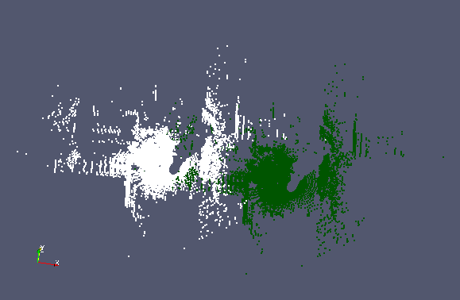

| [Tutorials Home](Tutorials.md)    | [Previous](Pointclouds.md) | [Next]() |
| ------------- |:-------------:| -----:|

# Applying Transformations to Point Clouds
######Latest update January 24, 2014 by Samuel Charreyron

The outcome of a point cloud registration is some rigid transformation which, when applied to the reading point cloud, best aligns it with the reference point cloud.  This transformation can be represented algebraically with a square matrix of the dimensions of the homogeneous point coordinates. A point cloud is transformed by left-multiplying it by the transformation matrix.

In libpointmatcher, transformations are encapsulated in a TransformationParameters object, which is itself simply an Eigen matrix.

### Example: Applying a Translation
In the following example we manually define a transformation by specifying the TransformationParameters object to represent a translation in the x direction.  We do so by setting the top right element of the transformation Eigen matrix to be 50, such that the point cloud will move by 50 meters in the x direction.  We apply this transformation to an input point cloud and save the output point cloud.

```cpp
#include <pointmatcher/PointMatcher.h>
#include <iostream>
#include <fstream>

typedef PointMatcher<float> PM;

int main(int argc, char *argv[]) {

    if (argc != 3) {
        std::cerr << "Error: invalid number of arguments" << std::endl;
    }

	PM::TransformationParameters T;
	T = PM::TransformationParameters::Identity(4,4);
	// Applying a translation in the x direction
	T(0,3) = 50;

	std::cout << "Transformation Matrix: " << std::endl << T << std::endl;

	// Load a point cloud from a file
	PM::DataPoints pointCloud;
	std::string inputFile = argv[1];
	pointCloud = PM::DataPoints::load(inputFile);

	// Compute the transformation
	PM::Matrix transformedPoints =  T * pointCloud.features;

	// Copy over labels
	PM::DataPoints::Labels labels = pointCloud.featureLabels;
	PM::DataPoints outputCloud(transformedPoints,labels);
	outputCloud.save(argv[2]);

	std::cout << "Transformed cloud saved to " << argv[2] << std::endl;
	return 0;
}
```
|**Figure:** Result of the transformation on `examples/data/car_cloud400.csv`.  The white points form the original point cloud, while the green points are the points which were translated.  |
|:---|
||


### Creating a Transformation Object